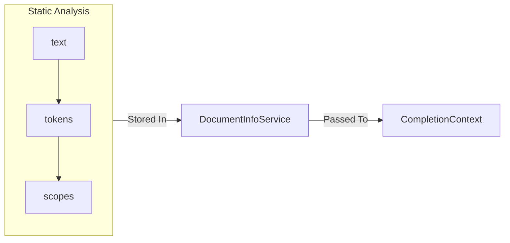

# Architecture

## Folder Structure

```text
src/
    extension.ts
    tape.ts
    completions.ts
    languages.ts
    scopes.ts
    <...HELPERS>
    test/
        runTests.ts
        <...LANG_ID>.test.ts
    services/
        <...FEATURE>_service.ts
    lang/
        <...LANG_ID>/
            completion_registry.ts
            language.ts
            scope_registry.ts
            <...HELPERS>
        all_completion_registries.ts
        all_languages.ts
        all_scope_registries.ts
```

## `tape.ts` — Cursor Data Structure

`Tape` is the most fundamental data structure used by this extension. It is a cursor over string, and provides many utilities for procedural parsing of substrings.

Unlike similar extensions, such as [HyperSnips](https://marketplace.visualstudio.com/items?itemName=draivin.hsnips), we rarely use regular expressions to parse documents. Through direct comparison, regex has been shown to be both slower and less capable. In contrast, `Tape` provides the ability to backtrack and perform recursive descent with minimal cost.

The downside of using a cursor is that parsing logic must largely be written by hand. Although parsing primitives are provided (e.g. `consume`, `seek`, `isAt`), combining them to recognize complex syntax must still be done by the user. In our experience, this is worth the performance gain, and it has made finding parsing logic errors much easier to find.

## `extension.ts` — Startup/Shutdown

The entry point, like for all other extensions, is the `activate` function. This function should have no other purpose than to activate all services and handle errors during activation.

```ts
function activate(context: ExtensionContext) {
    try {
        // activate services by passing context
        // log success
    } catch (e) {
        // handle and log fatal errors during activation
    }
}
```

The exit point, `deactivate`, should serve no other purpose than to log successful deactivation. Since the extension lives entirely within the VS Code runtime, no deactivation logic is necessary.

```ts
function deactivate() {
    // log success
}
```

## `completions.ts`, `languages.ts`, `scopes.ts` — Pipeline APIs

//todo

## `services/` — Services

**Services** are classes that implement the singleton pattern through their static instance. All services provide a `start` function, declare a private constructor, and contain no functions returning an instance of that class. After `start` is called, a feature is added to the editor environment for as long as the extension is active.

```ts
class BasicService {
    private constructor() {}

    static start(ctx: ExtensionContext) {
        // Initialization logic, such as pushing subscriptions
    }
}
```



`start` is `async`, and can expect either no arguments or a single `vscode.ExtensionContext`. The only time that the initializer should be called is once within `activate`.

Although all services are initialized at extension activation, some services may depend on other services. Therefore, `start` for any immediate dependencies should be called in a service's own initializer. Because multiple instances of the same dependency may exist, `start` is made to be idempotent.

Service classes can also contain static mutable fields to be used by the various static utility functions provided by that service. Though it is tempting to declare a common service `interface`, static object are not permitted to extend interfaces. Therefore, compliance to the service pattern cannot be strictly enforced without transferring responsibility to a class instance. To make things simple, we have decided not to pursue this pattern.

Files declaring services end in `_service.ts`. The service class declared in each of these files is the default export. These files may also contain utilities and other classes that are tightly coupled to the service (e.g. `IntervalTree` for `IntervalTreeService`).

## `test/` — Unit Testing

The testing suite relies on VS Code's extension testing runner (`@vscode/test-electron`) to execute tests inside an actual instance of the editor environment.

Unit tests are dispatched and synced using [Mocha](https://mochajs.org/).

- `runTests.ts`: Initializes Mocha and reads `.test.ts` files before delegating to the test runner.
- `<...LANG_ID>.test.ts`: Unit test suite for each supported language.

When writing unit tests, favor testing `Tape` parsing logic and scope resolution over simulating user input streams, since unit-level cursor assertions execute significantly faster and yield clearer stack traces.

### `lang/<LANG_ID>/completion_registry.ts` — Language Support Implementation


### `lang/<LANG_ID>/language.ts` — Language Support Implementation


### `lang/<LANG_ID>/scope_registry.ts` — Language Support Implementation


## `lang/all_*.ts` —  Aggregation of Language Specifics

All completion registries, `Language`s, and scope registries are aggregated to a single `Record` per item type, where each key is the [ID](https://code.visualstudio.com/docs/languages/identifiers) of a supported language.